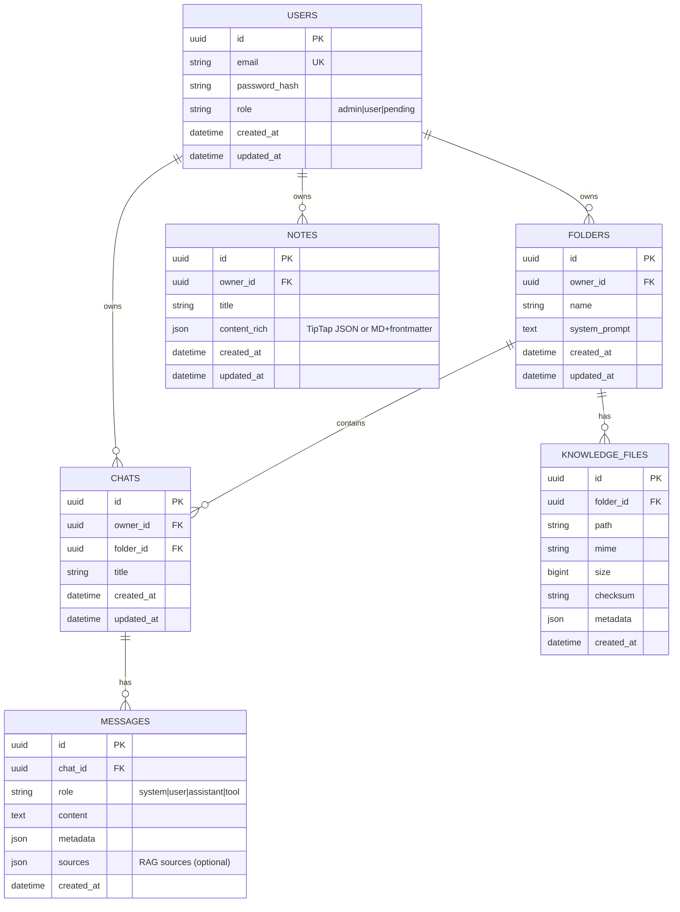

# Data Model

Status: Draft for Phase 1 MVP

This document defines the initial relational schema, entities, relationships, indices, and migration policy. The MVP targets SQLite by default with a path to Postgres (including PGVector) for later phases.

## Entities and Relationships (ERD)

Mermaid ER diagram (authoritative for relationships)

Files:
- diagrams/data-model.mmd (to be generated from the above if needed)
- diagrams/data-model.png
- diagrams/data-model.svg

## Table Specifications

### users
- id: UUID (PK)
- email: TEXT UNIQUE NOT NULL
- password_hash: TEXT NOT NULL
- role: TEXT NOT NULL CHECK in ('admin','user','pending') DEFAULT 'pending'
- created_at: TIMESTAMP NOT NULL DEFAULT now
- updated_at: TIMESTAMP NOT NULL DEFAULT now

Indices:
- ux_users_email (UNIQUE)
- ix_users_created_at

### folders
- id: UUID (PK)
- owner_id: UUID NOT NULL REFERENCES users(id) ON DELETE CASCADE
- name: TEXT NOT NULL
- system_prompt: TEXT NULL
- created_at: TIMESTAMP NOT NULL DEFAULT now
- updated_at: TIMESTAMP NOT NULL DEFAULT now

Indices:
- ix_folders_owner_id
- ix_folders_created_at

### chats
- id: UUID (PK)
- owner_id: UUID NOT NULL REFERENCES users(id) ON DELETE CASCADE
- folder_id: UUID NULL REFERENCES folders(id) ON DELETE SET NULL
- title: TEXT NOT NULL
- created_at: TIMESTAMP NOT NULL DEFAULT now
- updated_at: TIMESTAMP NOT NULL DEFAULT now

Indices:
- ix_chats_owner_id
- ix_chats_folder_id
- ix_chats_created_at

### messages
- id: UUID (PK)
- chat_id: UUID NOT NULL REFERENCES chats(id) ON DELETE CASCADE
- role: TEXT NOT NULL CHECK in ('system','user','assistant','tool')
- content: TEXT NOT NULL
- metadata: JSON NULL
- sources: JSON NULL  (vector/RAG provenance)
- created_at: TIMESTAMP NOT NULL DEFAULT now

Indices:
- ix_messages_chat_id
- ix_messages_created_at

### knowledge_files
- id: UUID (PK)
- folder_id: UUID NULL REFERENCES folders(id) ON DELETE SET NULL
- path: TEXT NOT NULL
- mime: TEXT NOT NULL
- size: BIGINT NOT NULL
- checksum: TEXT NOT NULL
- metadata: JSON NULL
- created_at: TIMESTAMP NOT NULL DEFAULT now

Indices:
- ix_knowledge_files_folder_id
- ux_knowledge_files_checksum (UNIQUE suggested)
- ix_knowledge_files_created_at

### notes
- id: UUID (PK)
- owner_id: UUID NOT NULL REFERENCES users(id) ON DELETE CASCADE
- title: TEXT NOT NULL
- content_rich: JSON NOT NULL
- created_at: TIMESTAMP NOT NULL DEFAULT now
- updated_at: TIMESTAMP NOT NULL DEFAULT now

Indices:
- ix_notes_owner_id
- ix_notes_created_at

## Vector Store Schema (External)

Vector stores (Chroma or Qdrant initially; PGVector later) manage their own collections. For each chunk:
- id (UUID) – points back to a knowledge chunk
- text (string)
- embedding (vector)
- metadata: { file_id, checksum, page?, section?, folder_id?, mime?, created_at }

On deletion of knowledge_files.id, cascade delete vectors whose metadata.file_id matches.

## Migration Policy

- Alembic baseline in Phase 1.
- One migration per feature phase:
  - 0001_init: users, folders, chats, messages, knowledge_files, notes.
  - 0002_indexes: add or adjust indices after profiling.
  - 0003_notes_enhance: add any new fields (e.g., shared flags) in Phase 5.
- Revisions must be immutable; never edit historical migrations—create forward migrations.
- Default SQLite; Postgres migration parity maintained.

## Constraints and Integrity

- Foreign keys with ON DELETE cascade for ownership entities (users -> folders/chats/notes).
- ON DELETE SET NULL for folder_id on chats and knowledge_files to preserve items if folder removed.
- CHECK constraints on role and message.role.
- Triggers (optional) to maintain updated_at.

## Privacy and Retention

- Soft delete (optional): add deleted_at fields if needed later.
- PII: users.email – encrypted at rest if DB supports; restrict logs.
- Storage purge must remove vectors, file content, and any caches.

## Performance Considerations

- Index by created_at for chronological listings.
- Composite indices by (owner_id, created_at) for dashboards.
- Message retrieval paginated; only fetch recent N by default.
- Vector DB tuned per backend (Chroma: persist_dir; Qdrant: payload indices; PGVector: ivfflat or hnsw index).

## Example Alembic Heads-Up

- Use server_default text for timestamps in SQLite vs Postgres differences.
- For JSON fields, in SQLite store TEXT with JSON-encoded content; in Postgres use JSONB.