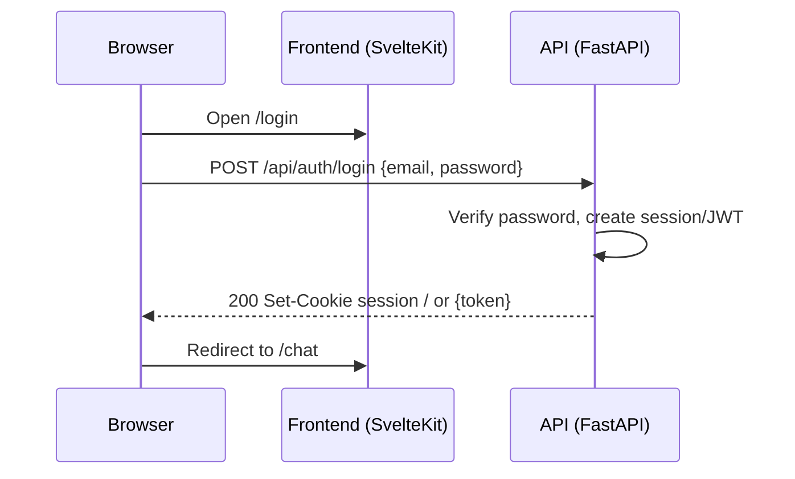
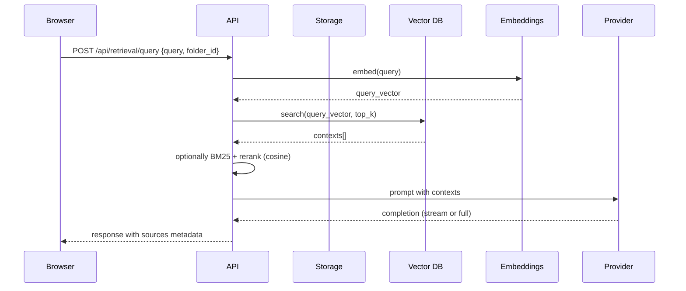
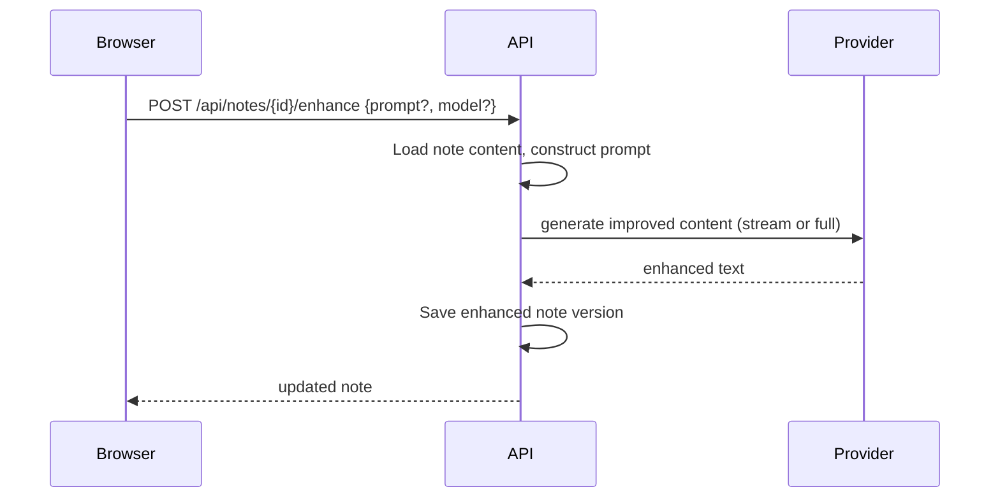

Executive summary
This repository is a full-stack AI chat and knowledge system with a SvelteKit (Vite + Tailwind) frontend and a FastAPI (Uvicorn) backend. It supports streaming chat with local and remote model providers (Ollama and OpenAI-compatible), a Retrieval Augmented Generation (RAG) pipeline with pluggable vector databases, a notes editor (TipTap v3), multi-locale i18n via i18next, folder/project organization and admin/workspace management. The backend is async-first with modular routers, optional Redis for WebSocket scale-out, and Docker Compose-based development including vector DB services.

Goals
- Provide a clear inventory and architecture reconstruction from the provided sourcecode tree.
- Define core functions for a staged rebuild.
- Deliver a phased plan with pragmatic scope for first working system, then extend.
- Produce comprehensive documentation and diagrams for engineering, ops, and testing.
- Ensure all links, examples, and assumptions are explicit.

Non-goals
- Implement full production-grade K8s and external cloud integrations at this stage.
- Implement all optional providers and tool servers; note them for roadmap.

1) Codebase discovery and inventory
Scope of analysis
All paths under sourcecode/ were examined, including hidden/config files, scripts, tests, and docs. Highlights and representative files are referenced.

Top-level files and configs
- sourcecode/.dockerignore — excludes docs, kubernetes, node_modules, .svelte-kit, package, .env*, uploads, __pycache__, .db, backend/data.
- sourcecode/.env.example — env vars for OLLAMA_BASE_URL, OPENAI API base/key, CORS_ALLOW_ORIGIN, FORWARDED_ALLOW_IPS, DNT flags.
- sourcecode/.eslintignore and sourcecode/.eslintrc.cjs — ESLint setup for TS, Svelte, Cypress; ignores build artifacts.
- sourcecode/.prettierignore and sourcecode/.prettierrc — Prettier with svelte plugin.
- sourcecode/tailwind.config.js, sourcecode/postcss.config.js — Tailwind integration.
- sourcecode/svelte.config.js — SvelteKit configuration.
- sourcecode/vite.config.ts — Vite with sveltekit(), static copy of onnxruntime-web wasm artifacts via vite-plugin-static-copy, build sourcemaps, tree-shake console logs in non-dev, worker format ES, APP_VERSION and APP_BUILD_HASH defines.
- sourcecode/package.json and sourcecode/package-lock.json — Frontend dependencies; Cypress present; i18next parser config sourcecode/i18next-parser.config.ts.
- sourcecode/pyproject.toml and sourcecode/uv.lock — Python backend dependencies (FastAPI, Uvicorn, SQLAlchemy, Pydantic, Chroma/Qdrant clients, etc).
- Docker and composition:
  - sourcecode/Dockerfile
  - Compose variants: sourcecode/docker-compose.yaml, sourcecode/docker-compose.gpu.yaml, sourcecode/docker-compose.api.yaml, sourcecode/docker-compose.data.yaml, sourcecode/docker-compose.otel.yaml, others for tests.
- CI/CD: sourcecode/.github/ exists (workflows assumed).
- K8s/Helm: sourcecode/kubernetes/ with helm/ and manifests under manifest/base and manifest/gpu.
- Docs placeholders: sourcecode/docs/ (project docs separate from this rebuild deliverable).
- Tests:
  - Cypress E2E: sourcecode/cypress/ with sourcecode/cypress.config.ts, e2e specs and support.
  - Backend pytest: sourcecode/backend/open_webui/test structure with apps/webui sub-tests and util.
- Scripts:
  - Root helper scripts: sourcecode/run.sh, sourcecode/run-compose.sh, sourcecode/run-ollama-docker.sh, sourcecode/update_ollama_models.sh, sourcecode/confirm_remove.sh.
  - Python utility: sourcecode/contribution_stats.py.

Frontend structure
- SvelteKit app: sourcecode/src/ with:
  - API client modules: sourcecode/src/lib/apis/* including chats, models, auths, users, files, folders, knowledge, retrieval, notes, audio, tools, streaming, openai, ollama, etc.
  - Components by domain: chat UI, messages renderer (Markdown), model selector, admin settings pages, workspace, knowledge manager, notes editor TipTap v3, layout/nav/sidebar with folders/projects (e.g., sourcecode/src/lib/components/chat/*, sourcecode/src/lib/components/notes/*, sourcecode/src/lib/components/workspace/*).
  - i18n: i18next with locales under sourcecode/src/lib/i18n/locales/.
  - Stores and types: sourcecode/src/lib/stores/, sourcecode/src/lib/types/.
  - Workers & utilities: sourcecode/src/lib/workers/, sourcecode/src/lib/utils/.
  - Static assets: sourcecode/static/.
- Build tools: Vite + SvelteKit + Tailwind + PostCSS. TipTap v3 used for rich text editor (ref. CHANGELOG).

Backend structure
- FastAPI open_webui package:
  - Routers: sourcecode/backend/open_webui/routers/ (auth, users, chats, models, tools, knowledge, retrieval, files, audio, notes, admin).
  - WebSocket helpers: sourcecode/backend/open_webui/socket/.
  - ORM models: sourcecode/backend/open_webui/models/.
  - Migrations: sourcecode/backend/open_webui/migrations/ and internal/migrations/.
  - Retrieval: sourcecode/backend/open_webui/retrieval/ including loaders, embedding models, vector backends under vector/dbs and web search adapters.
  - Storage: sourcecode/backend/open_webui/storage/ with filesystem and S3-like adapters.
  - Static: sourcecode/backend/open_webui/static/ including swagger assets.
  - Utilities: sourcecode/backend/open_webui/utils/ including telemetry and images.

Primary languages
- Frontend: TypeScript, Svelte.
- Backend: Python 3.11.
- Shell scripts for orchestration.

Key dependencies and tools
Frontend
- SvelteKit, Vite, TypeScript, i18next, TailwindCSS, TipTap v3, Cypress. onnxruntime-web copy via vite-plugin-static-copy.
- mermaid dependency is present for diagrams in-app; we will use mermaid-cli for rendering docs diagrams.
Backend
- FastAPI, Uvicorn, SQLAlchemy, Alembic, Pydantic.
- WebSockets/SSE support.
- Vector DB clients: Chroma, Qdrant; optional Pinecone/PGVector.
- Files handling: python-multipart, unstructured, pypdf.
- Async HTTP: aiohttp, httpx.
- Redis optional for pub/sub and scale.
- Telemetry: basic counters and OpenTelemetry compose variant.

Testing
- Cypress e2e for UI.
- Pytest for API.

Linters/formatters
- ESLint + Prettier for frontend.
- Black, pylint for backend.

Environment files
- sourcecode/.env.example with OLLAMA_BASE_URL, OPENAI_API_BASE_URL/KEY, CORS_ALLOW_ORIGIN, FORWARDED_ALLOW_IPS, DO_NOT_TRACK flags.

Docker/K8s artifacts
- Dockerfile, multiple docker-compose.*.yaml, Kubernetes helm and manifests.

Module boundaries and ownership
- Frontend domain components own UI per feature.
- Backend routers mirror domain; retrieval and storage modules encapsulate vector/file subsystems; socket handles real-time.

2) Architecture and tech stack reconstruction
Frontend
- SvelteKit + Vite + Tailwind; SSR enabled.
- TipTap v3 editor in notes.
- i18n via i18next with multiple locales.
- Chat UI supports streaming rendering, stop button, model selector, folders/projects, admin/workspace pages.
- Vite plugin copies onnxruntime-web wasm at build.

Backend
- FastAPI + Uvicorn, async-first.
- Modular routers for auth, users, chats, folders, models, tools, knowledge, retrieval, files, audio, notes, admin.
- SSE initially; WebSockets for streaming chat and live collab notes later.
- Background tasks for indexing and uploads.

Persistence
- SQL DB: SQLite initially via SQLAlchemy + Alembic; Postgres later (PGVector support referenced).
- Vector DB: pluggable; local default Chroma or Qdrant; optional Pinecone/PGVector.
- Object storage: local filesystem default; pluggable S3-compatible later.
- Cache/pub-sub: Redis optional.

Model providers
- Local: Ollama proxy endpoints; streaming completions; embeddings; image gen passthrough.
- Remote: OpenAI-compatible; Azure OpenAI passthrough.

Retrieval
- Loaders (txt, md, pdf via pypdf), chunking, embeddings, hybrid BM25+vector fallback.

Tools
- Internal tools (web search stub, code interpreter artifacts), external tool servers via OpenAPI later.

CI/testing
- Cypress e2e for UI; Pytest for API; Playwright optional later.

Deployment
- Docker Compose for dev (frontend, backend, vector DB, optional Redis), K8s manifests/Helm later.

3) Core functions to rebuild first
Auth and sessions
- Local email+password; roles admin/user/pending; session cookie or JWT; CSRF for cookie mode; CORS for dev; OAuth deferred.

Chat with models
- Start chat; stream assistant messages via SSE; model selector with params (temperature, max tokens); attach files; show source metadata when RAG used; stop generation.

Knowledge base and RAG
- Upload, extract (txt/md/pdf), chunk, embed, index; retrieval endpoint; hybrid search vector + BM25 fallback.

Folders/projects
- CRUD; assign chats and knowledge; folder-level system prompt.

Notes
- CRUD; single-user edit initially; AI “enhance note”; optional audio transcription later.

Admin/workspace
- Manage users; model connections (Ollama URL, OpenAI key); flags (offline mode, telemetry).

Internationalization
- Baseline i18n structure; a few locales; full translations later.

File handling
- Local storage; safe MIME handling; deletion purges vectors.

Streaming and stop
- Stream responses; allow “stop generation.”

Telemetry
- DNT env; simple event counters.

4) Phased rebuild plan with implementation detail
Phase 0: Repo scaffolding and dev environment
- Monorepo: frontend/ (SvelteKit), backend/ (FastAPI), docker-compose.yaml (web, api, chroma or qdrant, optional redis).
- .env.example: OLLAMA_BASE_URL, OPENAI_API_KEY, CORS_ALLOW_ORIGIN, DATABASE_URL.
- Build config parity: Vite config with onnxruntime-web copy hook as in sourcecode/vite.config.ts.
- Tooling: ESLint/Prettier, Tailwind/PostCSS, i18next parser config.
- Scripts:
  - scripts/bootstrap.sh: env copy, run migrations, seed admin.
  - scripts/mermaid-render.sh: render Mermaid to PNG/SVG.
  - scripts/e2e-smoke.sh: start services and run Cypress smoke.

Phase 1: Backend core
- FastAPI routers:
  - auth (signup/login/logout; cookie or JWT),
  - users (read/update, roles),
  - chats (create/list/get/post message; SSE streaming endpoint),
  - models (list connections; call abstractions).
- Services: providers (Ollama, OpenAI for completions/embeddings) with timeout/retry; streaming generator yielding tokens.
- DB models: User, Chat, Message, Folder, KnowledgeFile, Note. Alembic migrations baseline.
- SSE first; WebSocket later for stop/cancel.

Phase 2: Frontend chat MVP
- Pages: auth + chat. State stores: session, selected model, chat list.
- Chat UI: messages list; markdown renderer; input with send; streaming rendering; stop button.
- Model selector: list from backend; choose provider/model. Minimal i18n initialized.

Phase 3: Knowledge & RAG
- Backend: upload endpoint; text extraction (txt/md, PDF via pypdf); chunking; embeddings via provider; vector DB (Chroma or Qdrant).
- Retrieval endpoint: query collections; return contexts. Hybrid: vector + BM25. Start vector-only if needed.
- Frontend: knowledge manager UI (upload/list/delete); attach knowledge to folder or model; toggle “full context.”

Phase 4: Folders/projects
- Backend: CRUD; assign chats and knowledge; system prompt per-folder.
- Frontend: sidebar folders; dedicated folder view listing chats within folder.

Phase 5: Notes MVP
- Backend: CRUD notes; permissions owner/shared; enhance endpoint using selected model.
- Frontend: notes list + TipTap v3 editor; “Enhance with AI”; copy/export as markdown.

Phase 6: Admin/workspace
- Backend: settings routes for connections/flags; users list with pagination; update user role.
- Frontend: pages for Connections (Ollama URL, OpenAI key, model list caching toggle), Users, workspace toggles.

Phase 7: Files and storage
- Local filesystem storage with safe paths; deletion cascades to vector deletes. S3 adapter interface toggled by env (implement later).

Phase 8: Stream stop, cancel, scaling niceties
- WebSocket-based streaming for reliable stop across replicas; Redis pub/sub optional. Logging with trace/span IDs returned via headers.

Phase 9: Internationalization expansion
- Wire i18n parser; include subset of locales; ensure key UIs are translatable.

Phase 10: Testing and deployment
- Backend Pytest: routers, services, RAG pipeline. Frontend Cypress: login, start chat, upload file, RAG answer, notes enhance.
- Docker Compose: api + frontend + chroma/qdrant; production Dockerfiles; basic K8s manifests.

5) Documentation set
This rebuild adds comprehensive documentation in docs/ and diagrams/. A machine-readable manifest is included.

6) Diagrams
Mermaid sources are embedded below; exports are linked. To render, install mermaid-cli and run scripts/mermaid-render.sh.

System context diagram
Mermaid source:
```mermaid
flowchart LR
  User[User/Browser]
  Frontend[SvelteKit Frontend]
  Backend[FastAPI Backend]
  SQL[(SQLite/Postgres)]
  VectorDB[(Chroma/Qdrant/Pinecone/PGVector)]
  ObjectStore[(Local FS / S3-compatible)]
  Redis[(Redis - optional)]
  Providers[[Ollama / OpenAI-compatible / Azure OpenAI]]

  User -->|HTTPS| Frontend
  Frontend -->|SSR/API| Backend
  Backend --> SQL
  Backend --> VectorDB
  Backend --> ObjectStore
  Backend -->|optional pub/sub| Redis
  Backend -->|HTTP(s)/WS| Providers
```
Files:
- diagrams/system-context.mmd
- diagrams/system-context.png
- diagrams/system-context.svg

Backend module/routers diagram
Mermaid source:
```mermaid
flowchart TB
  subgraph Routers
    Auth[/auth/]
    Users[/users/]
    Chats[/chats/]
    Models[/models/]
    Knowledge[/knowledge/]
    Retrieval[/retrieval/]
    FilesR[/files/]
    Notes[/notes/]
    Admin[/admin/]
  end

  Providers[Providers Service (Ollama/OpenAI/Azure)]
  Embeddings[Embeddings Service]
  RAG[RAG Pipeline]
  Storage[Storage Service (FS/S3)]
  ORM[SQLAlchemy Models]
  Vectors[Vector DB Client]
  SSE[SSE/WebSocket Streamer]
  Redis[(Redis optional)]

  Chats --> SSE
  SSE --> Redis
  Chats --> Providers
  Models --> Providers
  Retrieval --> RAG
  RAG --> Embeddings
  RAG --> Vectors
  Knowledge --> Storage
  FilesR --> Storage
  Notes --> Providers
  Auth --> ORM
  Users --> ORM
  Chats --> ORM
  Admin --> ORM
```
Files:
- diagrams/backend-modules.mmd
- diagrams/backend-modules.png
- diagrams/backend-modules.svg

Sequence: login

Files:
- diagrams/seq-login.mmd
- diagrams/seq-login.png
- diagrams/seq-login.svg

Sequence: chat streaming (SSE first, WS later)
```mermaid
sequenceDiagram
  participant B as Browser
  participant F as Frontend
  participant A as API
  participant P as Provider

  B->>F: Send message
  F->>A: POST /api/chats/{id}/messages (SSE)
  A->>P: Start streaming completion
  P-->>A: token...
  A-->>F: event: token (delta)
  F-->>B: render appended text
  loop until done
    P-->>A: token
    A-->>F: token
  end
  A-->>F: event: done
  Note over B,F: Stop button closes SSE; WS later supports cancel signal
```
Files:
- diagrams/seq-chat-streaming.mmd
- diagrams/seq-chat-streaming.png
- diagrams/seq-chat-streaming.svg

Sequence: RAG query pipeline

Files:
- diagrams/seq-rag-pipeline.mmd
- diagrams/seq-rag-pipeline.png
- diagrams/seq-rag-pipeline.svg

Sequence: note enhance

Files:
- diagrams/seq-note-enhance.mmd
- diagrams/seq-note-enhance.png
- diagrams/seq-note-enhance.svg

Deployment diagram (Compose dev and future K8s)
```mermaid
flowchart LR
  subgraph Docker Compose (dev)
    FE[frontend: SvelteKit dev server]
    API[backend: FastAPI + Uvicorn]
    VDB[(Chroma/Qdrant)]
    REDIS[(Redis - optional)]
  end
  FE --> API
  API --> VDB
  API --> REDIS

  subgraph Future K8s
    Ingress[Ingress]
    FEsvc[FE Service]
    APIsvc[API Service]
    VDBsts[VectorDB StatefulSet]
    RedisDep[Redis Deployment]
  end
  Ingress --> FEsvc
  Ingress --> APIsvc
  APIsvc --> VDBsts
  APIsvc --> RedisDep
```
Files:
- diagrams/deployment.mmd
- diagrams/deployment.png
- diagrams/deployment.svg

7) Setup instructions
Prereqs
- Node 20+, PNPM/NPM
- Python 3.11
- Docker + Docker Compose
- Mermaid CLI (mmdc) for diagram exports, e.g.: npm i -g @mermaid-js/mermaid-cli

Env vars
- Copy .env.example to .env and configure:
  - OLLAMA_BASE_URL=http://localhost:11434
  - OPENAI_API_BASE_URL=
  - OPENAI_API_KEY=
  - CORS_ALLOW_ORIGIN=http://localhost:5173;http://localhost:8080
  - DATABASE_URL=sqlite:///./data/app.db (assumed)
  - FORWARDED_ALLOW_IPS=*
  - DO_NOT_TRACK=true

Bootstrap
- bash scripts/bootstrap.sh
- docker compose -f sourcecode/docker-compose.yaml up -d
Local URLs
- Frontend: http://localhost:5173 (dev) or served by FastAPI in prod compose
- API: http://localhost:8080 (per compose mapping)

8) Development workflows
Frontend
- npm install --force
- npm run dev
- Lint/format: npm run lint, npm run format
Backend
- Run API with reload: uvicorn open_webui.app:app --reload
- Alembic: alembic revision --autogenerate -m "init"; alembic upgrade head
- Tests: pytest -q
RAG providers
- Configure in Admin > Connections; set OLLAMA_BASE_URL or OPENAI keys.

9) API design (summary)
Auth
- POST /api/auth/signup {email, password}
- POST /api/auth/login {email, password}
- POST /api/auth/logout
Users
- GET /api/users?page=&page_size=
- PUT /api/users/{id}/role {role}
Models
- GET /api/models
- POST /api/completions (SSE streaming)
- POST /api/embeddings {input, model}
Chats
- POST /api/chats
- GET /api/chats?folder_id=
- GET /api/chats/{id}
- POST /api/chats/{id}/messages {role, content, files?} — SSE stream
Knowledge & Retrieval
- POST /api/knowledge/upload
- GET /api/knowledge?folder_id=
- DELETE /api/knowledge/{id}
- POST /api/retrieval/query {query, folder_id?, top_k?, hybrid?}
Folders
- CRUD /api/folders
Notes
- CRUD /api/notes
- POST /api/notes/{id}/enhance
Admin/Workspace
- GET/PUT /api/admin/settings
- GET /api/admin/users, PUT /api/admin/users/{id}/role

Error shape
- { "error": { "code": "string", "message": "string", "details": {} }, "request_id": "uuid" }

Auth
- Session cookie default in dev; optional JWT mode.
- CSRF token via header for cookie mode on mutating requests.

Rate limiting
- Token bucket on chat generation endpoints.

10) Data model (summary)
- Users(id, email, password_hash, role, created_at, updated_at)
- Folders(id, name, system_prompt, owner_id, created_at)
- Chats(id, folder_id, owner_id, title, created_at)
- Messages(id, chat_id, role, content, metadata, created_at, source_refs[])
- KnowledgeFiles(id, folder_id, path, mime, size, checksum, created_at)
- Notes(id, owner_id, title, content_rich, created_at, updated_at)
- Indices by ownership and time columns; migration policy via Alembic.

11) RAG pipeline (summary)
- Loaders: txt, md, pdf (pypdf).
- Chunker: tokens/chars configurable; overlap default 200; header-aware splitter later.
- Embeddings: provider-selected (OpenAI/Ollama).
- Vector store: Chroma default; Qdrant alternative; schema includes text and metadata.
- Retrieval: top_k vector; hybrid BM25; cosine reranker; prompt assembly with context; latency/cost notes.

12) Streaming
SSE and WebSocket protocols
- SSE events: token, done, error; includes message deltas and sources.
- WebSocket later: allows stop/cancel and better multi-replica handling.
- Stop behavior: close SSE or send WS cancel; Redis pub/sub for coordination later.

13) Files/storage
- Structure: uploads/{user_id}/{date}/{uuid_filename}
- Safe MIME handling, path traversal prevention, upload limits.
- Antivirus hooks: Assumed placeholder; TODO to integrate if required.
- Deletion cascades to vector deletes by file-id/checksum.

14) i18n
- i18next namespaces per domain; SSR loading server-side; avoid secret leakage to clients.

15) Security
- Password hashing (bcrypt/argon2), role-based, CORS per env, CSRF for cookie auth, validation via Pydantic, upload size limits, path safety, secrets via env or mounted files.
- DNT flags to disable/limit telemetry.

16) Observability
- Structured logs with request_id/trace_id; counters for chats and tokens; sampling. OpenTelemetry via compose variant.

17) Testing
- Unit and integration tests for services and routers; fixtures for DB and storage; e2e Cypress flows for login/chat/upload/RAG/notes.

18) Deployment
- Dev: Docker Compose with api, frontend, vector DB, optional Redis.
- Staging/Prod: K8s manifests; GPU variant; secrets via K8s Secrets; scaling guidance.

19) Roadmap (deferred)
- OAuth providers, external tools via OpenAPI, audio STT/TTS, hybrid rerankers, telemetry polish, accessibility, PGVector encryption, LDAP integrations.

20) Tar-friendly listing of generated artifacts
docs/
- docs/api-reference.md — REST endpoints, auth, pagination, errors, examples.
- docs/data-model.md — ERD, table fields, constraints, indices, migration policy.
- docs/rag-pipeline.md — loaders, chunking params, embeddings, vector schema, retrieval, reranker, prompt assembly, cost/latency.
- docs/streaming-protocols.md — SSE and WebSocket schemas and stop/cancel behavior.
- docs/security-and-compliance.md — auth strategy, hashing, CORS/CSRF, RBAC, secrets, validation, upload limits, path safety, DNT.
- docs/operations-and-deployment.md — environment matrix, Docker images, compose and K8s, scaling heuristics, Redis usage guidance.
- docs/testing-strategy.md — unit/integration/e2e, fixtures, CI gates.
- docs/glossary.md — system terms and definitions.
- docs/manifest.json — manifest of docs and diagrams with title, description, source paths, hash placeholders, generated timestamp.

diagrams/
- diagrams/system-context.mmd — Mermaid source: system context.
- diagrams/system-context.png — PNG export.
- diagrams/system-context.svg — SVG export.
- diagrams/backend-modules.mmd — Mermaid source: backend routers/modules.
- diagrams/backend-modules.png — PNG export.
- diagrams/backend-modules.svg — SVG export.
- diagrams/seq-login.mmd — Mermaid source: login sequence.
- diagrams/seq-login.png — PNG export.
- diagrams/seq-login.svg — SVG export.
- diagrams/seq-chat-streaming.mmd — Mermaid source: chat streaming sequence.
- diagrams/seq-chat-streaming.png — PNG export.
- diagrams/seq-chat-streaming.svg — SVG export.
- diagrams/seq-rag-pipeline.mmd — Mermaid source: RAG pipeline sequence.
- diagrams/seq-rag-pipeline.png — PNG export.
- diagrams/seq-rag-pipeline.svg — SVG export.
- diagrams/seq-note-enhance.mmd — Mermaid source: note enhance sequence.
- diagrams/seq-note-enhance.png — PNG export.
- diagrams/seq-note-enhance.svg — SVG export.
- diagrams/deployment.mmd — Mermaid source: Compose and K8s deployment.
- diagrams/deployment.png — PNG export.
- diagrams/deployment.svg — SVG export.

scripts/
- scripts/mermaid-render.sh — Renders all .mmd to .png and .svg via mmdc.
- scripts/bootstrap.sh — Copies .env, runs migrations, seeds admin user.
- scripts/e2e-smoke.sh — Starts services, runs Cypress smoke tests.

21) Quality and verification
- Validate links and anchors after exports are generated.
- Code samples are pseudocode unless otherwise noted; API examples align with Phase 1 routes.
- Assumptions are labeled and include verification TODOs.
- SSE first; upgrade plan to WebSocket documented.
- SSR and i18n considerations avoid secret exposure.

Appendix: Inline Mermaid sources are mirrored to diagrams/*.mmd and must be rendered to PNG/SVG. Run:
npm i -g @mermaid-js/mermaid-cli
bash scripts/mermaid-render.sh